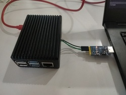

This project defines a Nix expression for building a custom Raspberry Pi NixOS installation image.

Features
--------

- Tested on RaspberryPi 4B.
- Default Linux tty is set to Raspberry Pi's' serial port.
- Nix flakes are enabled by default
- Secrets (wifi networks credentials) are read from a local expression.

Hardware
--------

- Host system: any NixOS
- Target system: RaspberryPi model 4B
- Serial-to-USB adaptor. We use
  [Nextion CP2102](https://www.amazon.com/NEXTION-CP2102-Adapter-Display-Beitian/dp/B07R3388DW)
  in USB-to-TTL mode. See also
  [Raspberry Pi serial port setup answer](https://raspberrypi.stackexchange.com/questions/108769/what-is-the-correct-way-to-connect-serial-console-on-rpi4-model-b)



Installation
------------

1. Better be on a NixOS machine. For Nix-capabale non-NixOS machines, everything should work as
   well, but one might need to figure out how to setup the cross-compilation.
2. For x86 NixOS, enable aarch64 cross-compilation by adding the following lines to your local
   machine's configuration and rebuild.
   ``` nix
   boot.binfmt.emulatedSystems = [ "aarch64-linux" ];
   ```
3. Prepare the secrets and lock the flakes. Currently we use secrets to pre-configure WiFi-networks:
   ``` shell
   $ cp ./secrets.nix.template ./_secrets.nix
   $ $EDITOR ./_secrets.nix
   $ nix registry add nixos-raspi-installer-secrets ./_secrets.nix
   $ nix flake update
   ```
3. Build the SD-card image by running `nix build '.#sdimage'`
4. Insert SD-card and write the image to it with
   ``` shell
   $ dd if=./result/sd-image/*.img of=/dev/sdX
   ```
   Replace `/dev/sdX` with the right SD-card device
5. Insert the SD-card into a Raspberry Pi.
6. Connect your board to a PC using a serial adaptor.
7. Boot and proceed with the regular NixOS installation.


References
----------

* [nixos-pi](https://github.com/lucernae/nixos-pi/) The main inspiration. Project aimed at building
  Raspberry Pi 3 installation image.
* [nixos-btrfs-pi](https://github.com/n8henrie/nixos-btrfs-pi) This project seems to build
  the image directly, bypassing the NixOS installer.
